<h1 align="center">Flow Studio · استودیوی گردش‌کار</h1>

<p align="center">
  یک محیط فارسی و راست‌چین برای ساخت، اجرای مرحله‌ای و بررسی گردش‌کارهای داده؛
  همه‌چیز در مرورگر شما.
</p>

<p align="center">
  
  
  
  
</p>

<p align="center">
  <a href="#gallery">نمایش تصویری</a> ·
  <a href="#templates">الگوهای آماده</a> ·
  <a href="#start">شروع سریع</a> ·
  <a href="#architecture">معماری</a> ·
  <a href="#checks">بررسی پروژه</a>
</p>

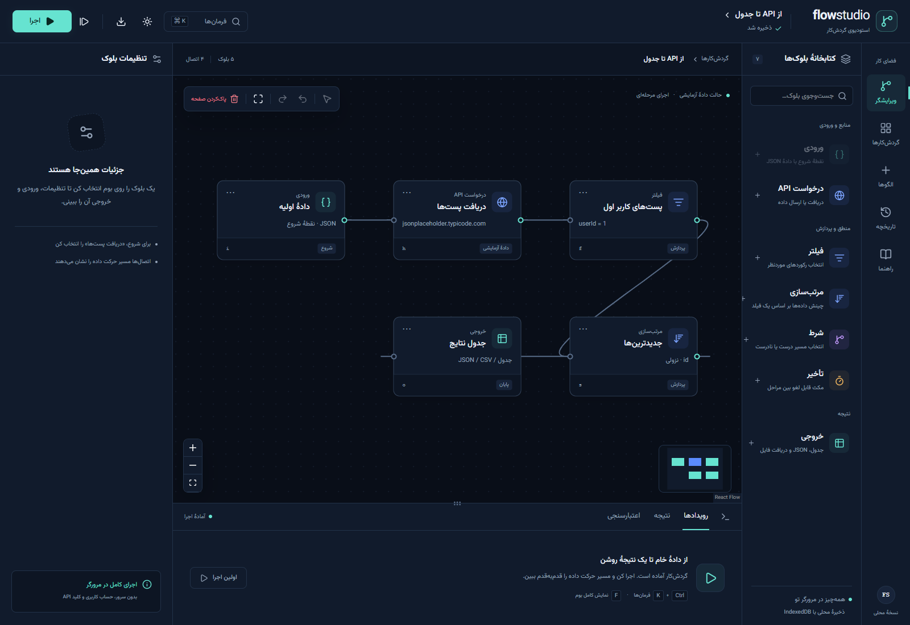

> تصویر بالا از اجرای واقعی برنامه گرفته شده است. نخستین گردش‌کار به‌صورت پیش‌فرض با **دادهٔ آزمایشی محلی** باز می‌شود؛ بنابراین برای دیدن نتیجه به API عمومی نیاز ندارید.

Flow Studio یک فرانت‌اند استاتیک با React و Vite است. گردش‌کار را روی بوم می‌سازید، مسیر داده را اجرا می‌کنید و ورودی، خروجی و وضعیت هر مرحله را می‌بینید. برای استفاده از برنامه، بک‌اند، حساب کاربری، کلید API یا سرویس هوش مصنوعی لازم نیست.

| ساخت                                          | اجرا                                         | بررسی                                              |
| :-------------------------------------------- | :------------------------------------------- | :------------------------------------------------- |
| ۷ نوع بلوک، اتصال و شاخهٔ شرطی، ۶ الگوی آماده | اجرای کامل یا تک‌مرحله‌ای، توقف، ادامه و لغو | اعتبارسنجی، تاریخچه، خروجی جدول/JSON/CSV و بازیابی |

<a id="gallery"></a>

## نمایش تصویری پروژه

همهٔ تصویرهای این بخش با مرورگر از خود برنامه ثبت شده‌اند. برای دیدن جزئیات، روی تصویرهای کوچک‌تر کلیک کنید.

### ویرایشگر: از بلوک تا نتیجه

بوم نقطه‌دار، کتابخانهٔ بلوک‌ها، تنظیمات بلوک انتخاب‌شده و کنسول اجرا را در یک نما کنار هم می‌بینید. بلوک‌ها را می‌توان جابه‌جا، وصل، کپی یا حذف کرد؛ دکمهٔ «پاک‌کردن صفحه» همهٔ بلوک‌ها و اتصال‌های گردش‌کار فعلی را با تأیید پاک می‌کند و با بازگردانی قابل برگشت است.

|                                                                          تنظیمات بلوک                                                                          |                                                                      نتیجهٔ اجرا                                                                      |
| :------------------------------------------------------------------------------------------------------------------------------------------------------------: | :---------------------------------------------------------------------------------------------------------------------------------------------------: |
| [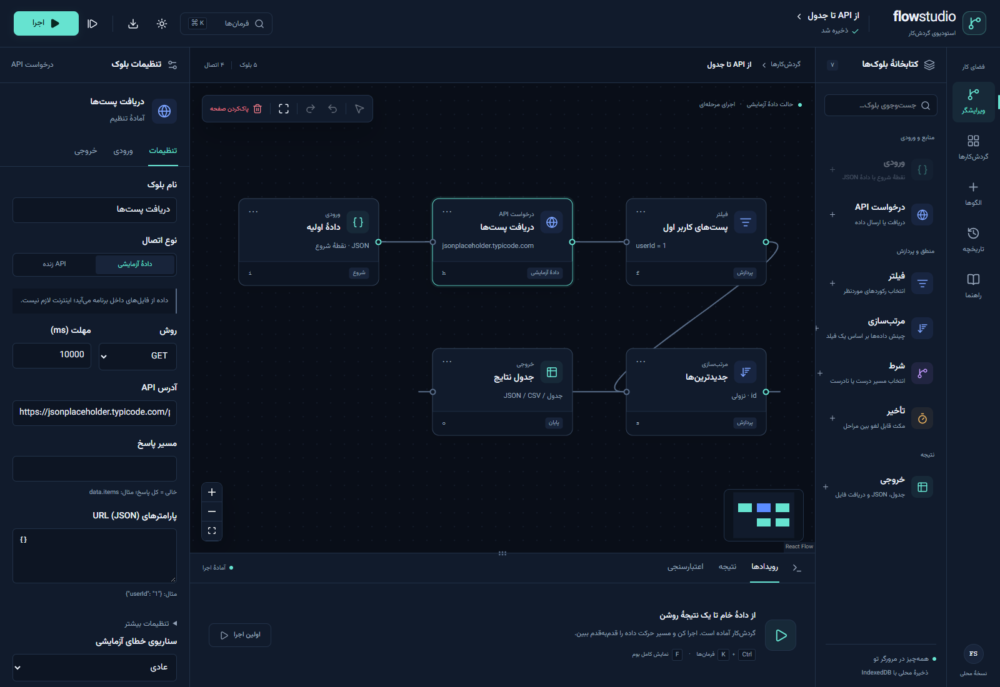](docs/screenshots/inspector-desktop.png) | [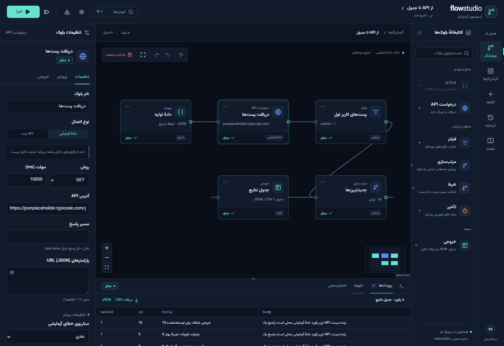](docs/screenshots/results-desktop.png) |
|                                                 درخواست، فیلتر، ورودی و خروجی از پنل تنظیمات قابل ویرایش‌اند.                                                  |                                          خروجی در جدول یا JSON دیده می‌شود و فایل CSV/JSON قابل دریافت است.                                           |

### الگوها و مسیرهای شرطی

شش الگوی قابل ویرایش، از یک زنجیرهٔ ساده تا گردش‌کارهای چندشاخه، آماده‌اند. در تصویر دوم، مسیر فوری و عادیِ الگوی «پردازش بر اساس اولویت» را می‌بینید؛ فقط شاخهٔ انتخاب‌شده اجرا می‌شود.

[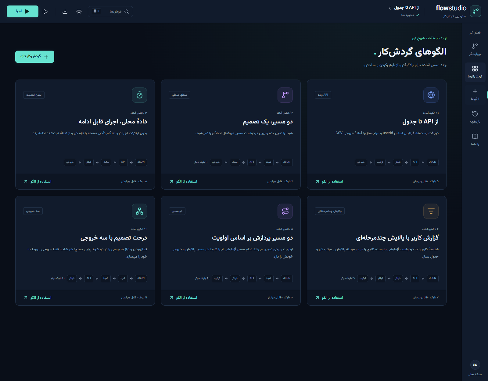](docs/screenshots/templates-desktop.png)

[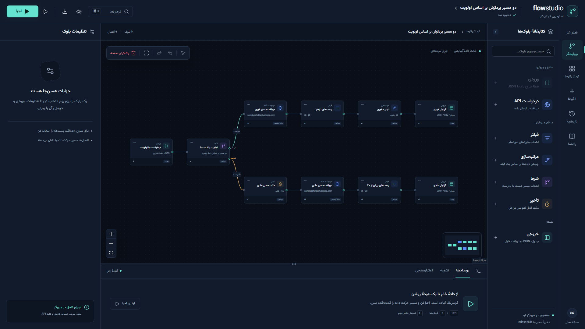](docs/screenshots/branches-desktop.png)

### بقیهٔ صفحه‌های برنامه

|                                                                       گردش‌کارهای من                                                                       |                                                                 تاریخچهٔ اجراها                                                                  |                                                                   راهنمای داخل برنامه                                                                    |
| :--------------------------------------------------------------------------------------------------------------------------------------------------------: | :----------------------------------------------------------------------------------------------------------------------------------------------: | :------------------------------------------------------------------------------------------------------------------------------------------------------: |
| [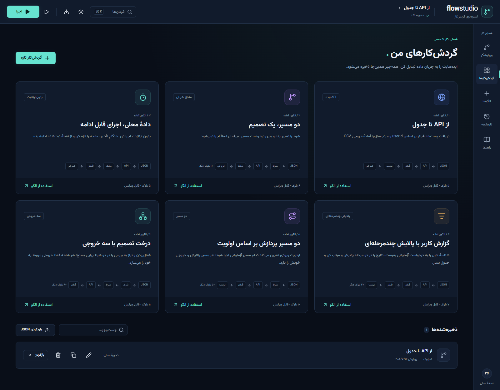](docs/screenshots/library-desktop.png) | [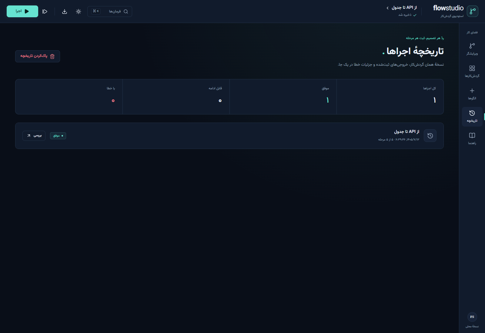](docs/screenshots/history-desktop.png) | [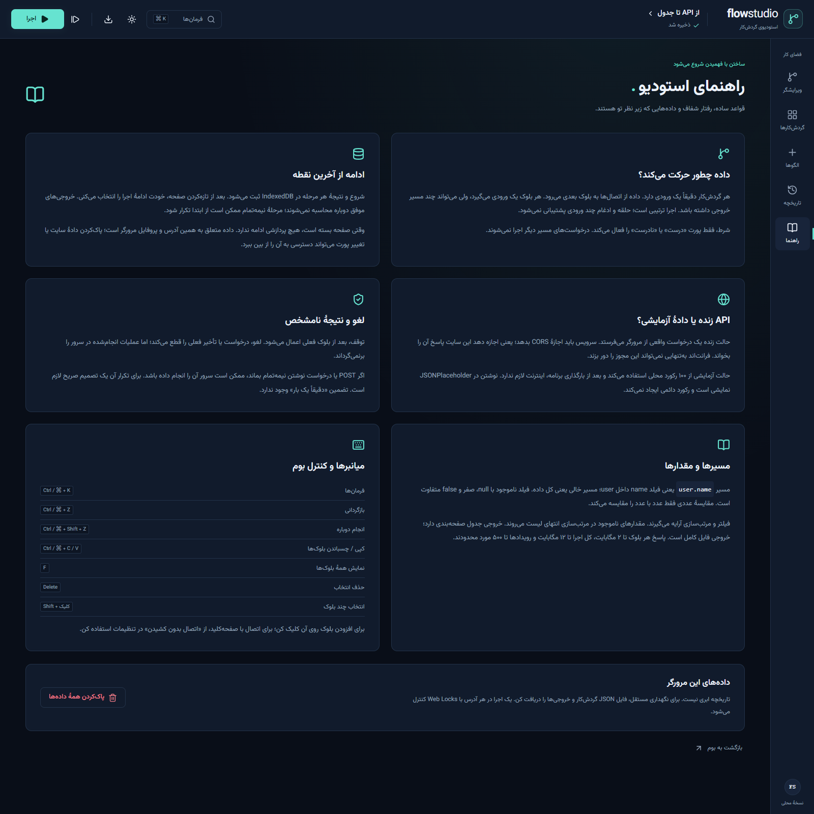](docs/screenshots/guide-desktop.png) |
|                                                     ساخت، جست‌وجو، کپی، تغییر نام، حذف و واردکردن JSON                                                     |                                                 وضعیت اجراها، تعداد مراحل و بررسی نسخهٔ ثبت‌شده                                                  |                                                     قواعد داده، محدودیت‌ها، بازیابی و میانبرهای بوم                                                      |

### شفافیت در وضعیت‌های حساس

|                                                                            جزئیات اجرای ثبت‌شده                                                                             |                                                                   اعتبارسنجی پیش از اجرا                                                                    |
| :-------------------------------------------------------------------------------------------------------------------------------------------------------------------------: | :---------------------------------------------------------------------------------------------------------------------------------------------------------: |
| [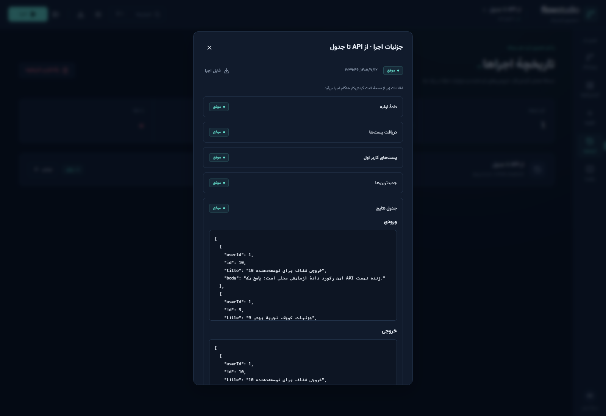](docs/screenshots/history-detail-desktop.png) | [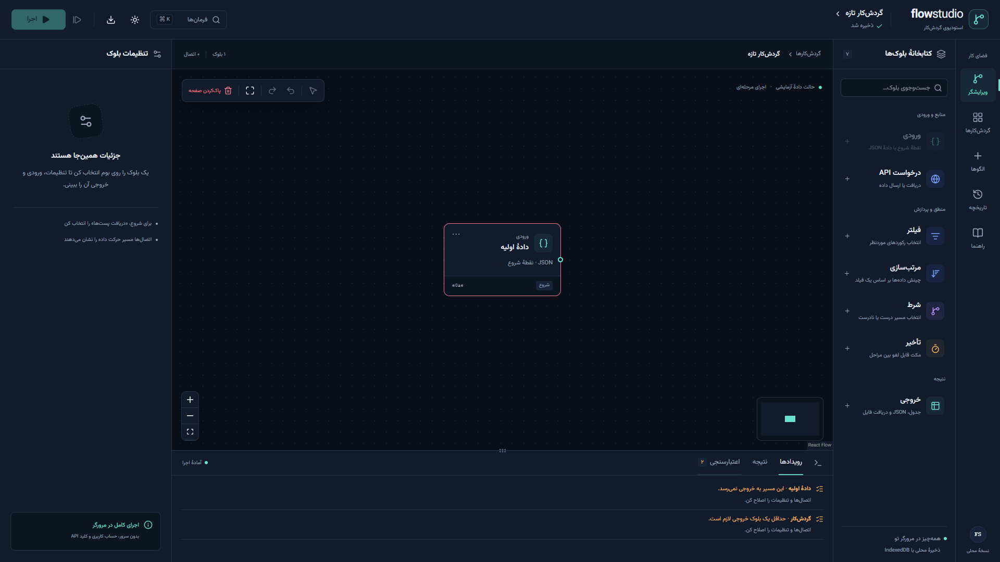](docs/screenshots/validation-desktop.png) |
|                                                        نسخهٔ ثابت گردش‌کار و نتیجهٔ هر بلوک برای بررسی باقی می‌ماند.                                                        |                                                   گراف ناقص پیش از اجرا با دلیل و راه اصلاح مشخص می‌شود.                                                    |

|                                                           خطای آزمایشی و مسیرهای اجرا نشده                                                            |                                                                    ادامه پس از تازه‌کردن صفحه                                                                     |
| :---------------------------------------------------------------------------------------------------------------------------------------------------: | :---------------------------------------------------------------------------------------------------------------------------------------------------------------: |
| [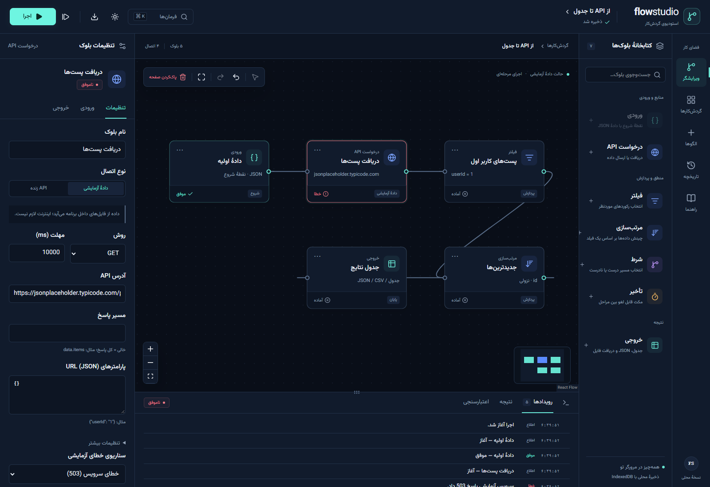](docs/screenshots/error-desktop.png) | [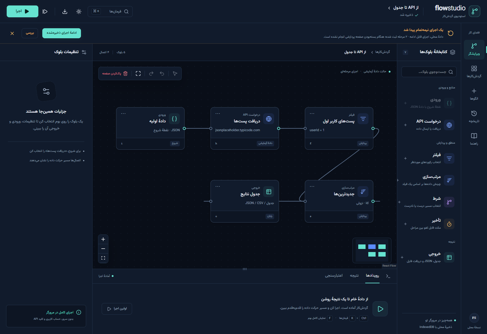](docs/screenshots/recovery-desktop.png) |
|                                              خطا و بلوک‌های بعدیِ اجرا نشده در بوم و کنسول دیده می‌شوند.                                              |                                                    بعد از بازشدن دوبارهٔ صفحه، ادامه‌دادن تصمیم خود کاربر است.                                                    |

|                                                                       تأیید پاک‌سازی بوم                                                                       |                                                                                                                                 نمای موبایل؛ تیره و روشن                                                                                                                                 |
| :------------------------------------------------------------------------------------------------------------------------------------------------------------: | :--------------------------------------------------------------------------------------------------------------------------------------------------------------------------------------------------------------------------------------------------------------------------------------: |
| [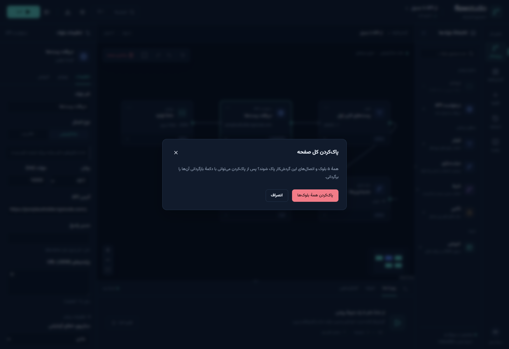](docs/screenshots/clear-confirm-desktop.png) | [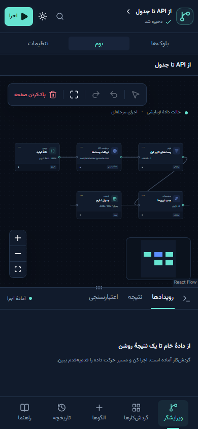](docs/screenshots/mobile-dark.png) [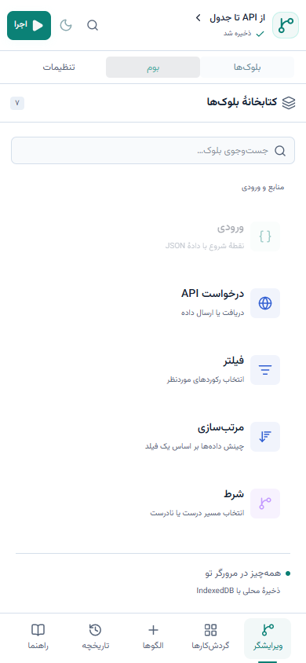](docs/screenshots/mobile-light.png) |
|                                                     پاک‌کردن کل بوم یک عمل تأییدشده و قابل بازگردانی است.                                                      |                                                                                                                  بوم، بلوک‌ها و تنظیمات در صفحهٔ باریک جابه‌جا می‌شوند.                                                                                                                  |

<a id="templates"></a>

## شش الگوی آماده

| الگو                              | بلوک | ایدهٔ قابل آزمایش                                                                             |
| :-------------------------------- | ---: | :-------------------------------------------------------------------------------------------- |
| از API تا جدول                    |    ۵ | دریافت پست‌ها، فیلتر کاربر، مرتب‌سازی و خروجی CSV؛ الگوی کتابخانه روی API زنده تنظیم شده است. |
| دو مسیر، یک تصمیم                 |    ۶ | شرط `active` را تغییر دهید و ببینید شاخهٔ غیرفعال درخواست نمی‌فرستد.                          |
| دادهٔ محلی، اجرای قابل ادامه      |    ۵ | هنگام تأخیر صفحه را تازه کنید و از آخرین مرحلهٔ ثبت‌شده ادامه دهید.                           |
| گزارش کاربر با پالایش چندمرحله‌ای |    ۷ | نگاشت `userId` به درخواست آزمایشی، دو فیلتر، مرتب‌سازی و جدول خروجی.                          |
| دو مسیر پردازش بر اساس اولویت     |   ۱۰ | مقدار `priority` مسیر فوری یا عادی را انتخاب می‌کند؛ هر شاخه خروجی خودش را دارد.              |
| درخت تصمیم با سه خروجی            |   ۱۱ | دو شرط پیاپی روی `active` و `audit` یکی از سه مسیر را فعال می‌کنند.                           |

درخواست‌های الگوهای جدید روی **دادهٔ آزمایشی محلی** تنظیم شده‌اند. حالت آزمایشی ۱۰۰ پست نمونه دارد و پاسخ API زنده نیست. در الگوی نخست نیز نسخه‌ای که در اولین بازدید باز می‌شود برای اجرای فوری به حالت آزمایشی تغییر داده شده است؛ برای درخواست واقعی، نوع اتصال بلوک HTTP را به «API زنده» تغییر دهید.

## امکانات اصلی

- **طراحی بصری:** ورودی JSON، درخواست HTTP، فیلتر، مرتب‌سازی، شرط، تأخیر و خروجی؛ انتخاب چندتایی، اتصال دوباره، کپی/چسباندن و بازگردانی.
- **اجرای قابل بررسی:** اجرای کامل یا تک‌مرحله‌ای، توقف در مرز بلوک، ادامه و لغو. پیشرفت هر مرحله پیش از رفتن به مرحلهٔ بعد در IndexedDB ثبت می‌شود.
- **داده و خروجی:** جدول صفحه‌بندی‌شده، نمایش JSON، دریافت CSV/JSON و نگاشت دادهٔ ورودی به query یا بدنهٔ درخواست.
- **مدیریت محلی:** ذخیرهٔ خودکار گردش‌کارها و تاریخچه، واردکردن/دریافت فایل JSON، دو پوسته و رابط واکنش‌گرا.
- **خطای روشن:** اعتبارسنجی گراف پیش از اجرا، سناریوهای آزمایشی HTTP/timeout/JSON و نمایش دلیل خطا و اقدام پیشنهادی.

<a id="start"></a>

## شروع سریع

**پیش‌نیاز:** Node.js نسخهٔ ۲۴ یا جدیدتر و npm. نسخهٔ Node پروژه در [`.nvmrc`](.nvmrc) آمده است.

```bash
git clone https://github.com/hamidshaikhy/flow-studio.git
cd flow-studio
npm ci
npm run dev
```

برنامه را در **[http://localhost:4173](http://localhost:4173)** باز کنید. `npm ci` برای نصب اولیه به اینترنت نیاز دارد. پس از بارگذاری، گردش‌کارهای آزمایشی بدون اینترنت هم اجرا می‌شوند.

برای یک بازدید سریع:

1. در ویرایشگر، روی «اجرا» بزنید؛ گردش‌کار پیش‌فرض از دادهٔ محلی استفاده می‌کند.
2. از «نتیجه» جدول را ببینید و CSV یا JSON بگیرید.
3. از «الگوها» یک گردش‌کار شرطی بسازید و مقدار ورودی را تغییر دهید.
4. «تاریخچه» و «بررسی» را باز کنید تا ورودی، خروجی و وضعیت هر بلوک را ببینید.

### ساخت نسخهٔ استاتیک

```bash
npm run build
npm run preview
```

خروجی در `dist/` قرار می‌گیرد و می‌تواند روی هاست استاتیک ارائه شود. فایل `index.html` را مستقیم با `file://` باز نکنید؛ برنامه به یک origin HTTP نیاز دارد. دادهٔ مرورگر به همان origin وابسته است؛ `localhost` و `127.0.0.1` فضای ذخیرهٔ جدا دارند.

<a id="architecture"></a>

## معماری در یک نگاه

```text
src/
├─ app/          وضعیت برنامه، ذخیره‌سازی رابط و مسیر صفحه‌ها
├─ features/     ویرایشگر، بلوک‌ها، گردش‌کارها، تاریخچه و راهنما
├─ lib/          مدل داده، اعتبارسنجی، موتور اجرا، HTTP و IndexedDB
└─ components/   اجزای مشترک رابط
tests/e2e/       سناریوهای مرورگری
docs/            مستندات و تصویرهای اجرای واقعی
scripts/         بازتولید تصویرهای README
```

React و React Flow رابط و بوم را می‌سازند؛ Zustand وضعیت رابط را نگه می‌دارد. منطق گراف، تبدیل داده، درخواست، اجرای مرحله‌ای و بازیابی در `src/lib` مستقل از React است. Zod مرز داده را بررسی می‌کند و `idb` ذخیره‌سازی محلی را انجام می‌دهد. قلم Vazirmatn و آیکون‌های Lucide داخل بستهٔ فرانت قرار می‌گیرند.

### مرزهای مهم

- با بستن صفحه، پردازشی در پس‌زمینه ادامه ندارد. ادامهٔ اجرای قطع‌شده فقط با انتخاب صریح کاربر آغاز می‌شود.
- اگر نتیجهٔ درخواست نوشتن نامشخص باشد، برنامه آن را خودکار تکرار نمی‌کند؛ تصمیم آگاهانه لازم است. لغو نیز عملیات انجام‌شده در سرور را برنمی‌گرداند.
- اطلاعات در IndexedDB همان مرورگر و همان origin ذخیره می‌شود؛ همگام‌سازی ابری وجود ندارد. فایل JSON را برای نگهداری مستقل دریافت کنید.
- درخواست زنده تابع CORS سرویس مقصد است. این پروژه proxy یا محل امن نگهداری رازها ندارد؛ کلید محرمانه وارد نکنید.
- هر گردش‌کار یک ورودی دارد، حلقه و ادغام چند ورودی پشتیبانی نمی‌شود و اجرا ترتیبی است.

جزئیات بیشتر در [معماری](docs/architecture.md) و [قرارداد اجرا و بازیابی](docs/execution-and-recovery.md) آمده است.

<a id="checks"></a>

## بررسی و بازتولید تصاویر

```bash
npm run format:check
npm run lint
npm run typecheck
npm test
npx playwright install chromium
npm run test:e2e
```

در بررسی این نسخه، **۵۱ تست واحد** و **۱۶ تست مرورگری** موفق شدند. تست مرورگری سناریوهای واقعی بوم، الگوها، خطا، ذخیره، بازیابی، شاخه‌های شرطی و موبایل را پوشش می‌دهد. گزارش دقیق‌تر در [docs/verification.md](docs/verification.md) است.

برای بازتولید گالری، پس از نصب Playwright و اجرای `npm run dev`، در ترمینال دیگری اجرا کنید:

```bash
npm run capture:screenshots
```

اسکریپت از پروفایل‌های مرورگر تازه استفاده می‌کند و تصاویر را در `docs/screenshots/` می‌نویسد. برای انتخاب Chrome/Chromium نصب‌شده می‌توانید `PLAYWRIGHT_EXECUTABLE_PATH` را تنظیم کنید.

### مستندات تکمیلی

- [راهنمای یادگیری و ارائهٔ پروژه](docs/learning-guide.md)
- [جزئیات اعتبارسنجی و آزمون‌ها](docs/verification.md)
- [راهنمای انتشار اختیاری روی GitHub Pages](docs/github-pages.md)
- [مجوز و اعتبار بسته‌ها و دارایی‌های ثالث](THIRD_PARTY_NOTICES.md)

**مجوز کد اصلی هنوز انتخاب نشده است.** فایل LICENSE برای آن در این ریپازیتوری وجود ندارد؛ مجوزهای وابستگی‌ها در `docs/licenses/` نگهداری می‌شوند.
